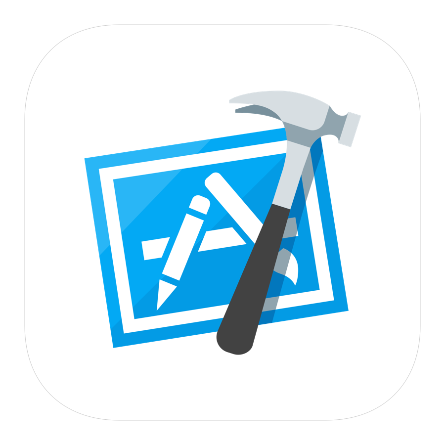

<h3 align="center">
  
</h3>

# Xcode Project Cleaner
Shell script that cleans up xcode projects. Works for both iOS and macOS.

If you have a problem running your Xcode project try solving it with just one `cleanup` terminal command!

## How to install it?
1. Clone or download the repo
2. Navigate to the `xcode_project_cleaner` folder
2. Install script `./install.sh`

## How to use it?
1. Navigate to your xcode folder
2. Execute `cleanup`

## How does it work?
Whole cleanup process is divided into 4 steps.

1. Cleaning derived data
2. Cleaning caches
3. Reinstalling pods
4. Cleaning build

After these steps, your Xcode project should successfully compile!